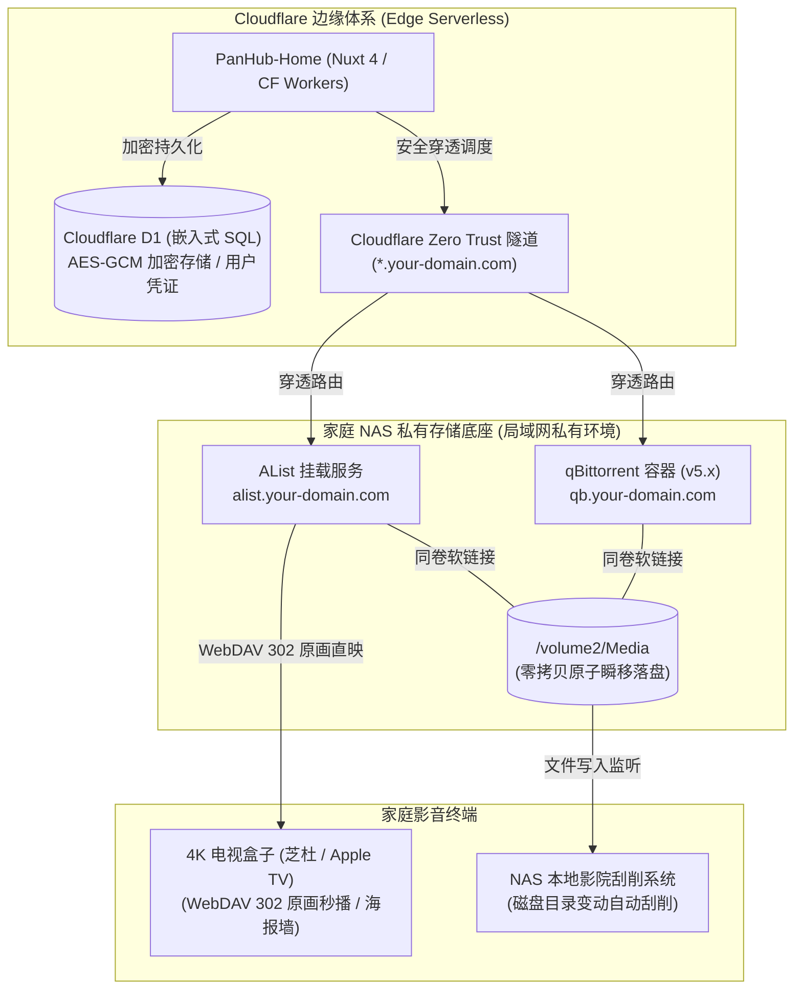

# PanHub-Home · 私有家庭智能影音中枢与边缘网盘搜索系统

<div align="center">

**家庭私有影音智能调度中枢 · Cloudflare Workers 边缘计算 · NAS 私有云硬件深度联动 · 电视盒子原画秒播生态**

[](https://nuxt.com/)
[](https://workers.cloudflare.com/)
[](https://developers.cloudflare.com/d1/)
[](./LICENSE)
[](./test)

</div>

---

## 📖 项目概述与架构演进

**PanHub-Home** 是一套面向高品质家庭数字生活打造的私有化生产级智能影音中枢系统。系统通过云端边缘无服务器计算（Serverless）深度联动本地家庭私有云存储（NAS），彻底打通全网资源检索、智能分流、高速离线与家庭影院原画直映的全链路。

- **云端边缘层**：基于 **Nuxt 4 (SSR/Edge)** 运行于 **Cloudflare Workers**，底层物理绑定 **Cloudflare D1 分布式关系型数据库**，提供全球就近极速响应与 SaaS 级多租户安全隔离；
- **家庭硬件底座**：深度联动家庭 NAS（支持绿联、群晖、威联通、极空间等）、**AList 存储中枢**、**qBittorrent v5.x 满速下载引擎**、以及 **芝杜 (Zidoo) / Apple TV / Kodi** 等 4K 原画播放设备；
- **全链路生产闭环**：实现了从 **全网多源精准召回 -> 磁力健康度雷达 -> 免转存动态挂载 / 穿透同步 / 满速原子落盘 -> 电视海报墙秒播 -> 冷热存储分层归档** 的完整闭环。

---

## 🏛️ 系统拓扑与数据流架构



---

## ✨ 核心特色与工程突破

### 1. 🔍 智能搜索与多源精准聚合
- **SSE 流式长连接 (`/api/search.stream`)**：单个长连接承载整次检索，后端按优先级切片并发抓取，增量 push，前端边搜边渲染；
- **20+ 插件矩阵与熔断隔离**：聚合主流磁力站点与各大网盘公开分享源，内置健康熔断器，单源异常绝不阻断全局；
- **中英双向元数据对齐**：针对海外做种站缺少中文标题导致的误杀，引入智能片名映射（如 `星际穿越 <-> Interstellar`），大幅提升海外原盘召回率；
- **BM25 概率打分与 Canonical 去重**：使用 `MiniSearch` (BM25) 进行分词打分；各大网盘通过规范化 Share ID 进行物理去重，彻底消除短链刷屏；
- **压制规格透传**：服务端完整保留影视正文详情，智能提取 4K/2160p、REMUX、HDR、音轨与正规字幕组分流标签。

### 2. 🧲 磁力健康度雷达 (Magnet Health Radar)
针对传统磁力下载“常遇死种、下载停滞”的痛点，创新引入磁力健康度实时雷达系统：
- **实时指标采集**：搜索阶段并发抓取各资源的做种节点数（`seeders`）与下载节点数（`leechers`）；
- **四级智能评级**：
  - 🔥 **极速 (Hot)**：`seeders >= 30`，百兆/千兆宽带秒级跑满；
  - 🟡 **良好 (Warm)**：`seeders >= 5`，顺畅稳定下载；
  - ❄️ **冷门 (Cold)**：`seeders > 0`，偏门小众稀有资源；
  - ⚠️ **死种 (Dead)**：`seeders === 0`，自动醒目标注失效风险；
- **多源择优合并**：同一资源在多站点检索到时，自动保留做种数更高、健康度更优的节点源。

### 3. 🚀 三大 NAS 推送与联动模式
针对不同协议与网盘生态，提供最适配的直通方案：
- ⚡ **方案 A（AList 动态分享挂载 · 原画秒播）**：
  - **适用**：115网盘、百度网盘、阿里云盘、123Pan 等支持分享直接挂载的网盘；
  - **机制**：通过 AList 接口在 NAS 上直接创建只读影视分享挂载点；
  - **优势**：**无需转存个人盘、不消耗个人网盘容量**，播放器通过 WebDAV 302 协议直连原盘秒播。
- 📦 **方案 B（转存个人盘 · 穿透同步）**：
  - **适用**：迅雷、夸克、UC、天翼云等受官方风控限制的网盘；
  - **机制**：一键复制提取码并引导至官方页面保存，存入后一键通知 AList 穿透刷新该目录缓存，电视海报墙即刻识别。
- 🧲 **方案 C（BT 离线直通 · 零拷贝原子瞬移）**：
  - **适用**：磁力链接、BT 种子、番剧更新；
  - **机制**：任务直达 qBittorrent 原生 Web API 队列，并自动注入 75+ 全球活跃 Tracker 矩阵；
  - **零拷贝设计**：临时块与落地存储均物理对齐于同一存储卷，下载完成后在底层文件系统执行 inode 秒级重命名，彻底杜绝跨卷 I/O 阻塞。

### 4. 📦 多网盘与本地存储冷热分层调度 (Storage Tiering)
- **释放 NAS 物理空间**：支持通过 `/api/nas/archive` 一键调用 AList `/api/fs/move` 调度队列；
- **冷热沉淀**：已追完的剧集或老电影一键安全归档至大容量网盘，本地高速存储池仅保留热门高频资源。

### 5. 📊 qBittorrent SSOT 实时遥测监控看板
- **单一真实来源 (SSOT)**：摒弃不可靠的离线状态推测，直接对接 qBittorrent 官方 Web API（`/api/v2/torrents/info`）；
- **全要素动态大屏**：实时展示上下行速率、做种数、下载数、ETA 倒计时、进度条百分比；
- **远程全维控制**：支持对在途下载任务执行在线暂停、继续以及安全移除。

### 6. 🛡️ SaaS 级多租户安全与 D1 物理持久化
- **多租户严格隔离**：用户在【我的 NAS】中配置的下载器凭证采用 Web Crypto AES-GCM 物理加密保存于 Cloudflare D1，各账号完全隔离，严禁越权窃用；
- **全自动回水与防闪烁**：前端在用户登录或页面唤醒时，主动静默从 D1 回写持久化配置，解决边缘计算冷启动丢失状态的弊端；
- **SSRF 深度门禁**：拦截非安全内网回环与敏感链路，公网暴露接口安全默认关闭 (Fail-Closed)。

---

## 🛠️ 技术栈与依赖架构

| 模块 | 选型与版本 | 职责与设计决策 |
| :--- | :--- | :--- |
| **应用框架** | Nuxt 4 (`^4.0.3`) + Vue 3 (`^3.5.18`) | 纯 ESM 架构，开箱即用 SSR 与边缘计算预设 |
| **边缘计算** | Cloudflare Workers + Nitro Module | 零本地 C++ 原生编译依赖，毫秒级轻量冷启动 |
| **边缘数据库** | Cloudflare D1 (`panhub-db`) | 嵌入式分布式 SQL，支持账号、邀请码、加密凭据持久化 |
| **搜索引擎** | MiniSearch (`^7.2.0`) + Intl.Segmenter | 纯 JS 实现的 BM25 相关度打分与分词算法 |
| **下载引擎** | qBittorrent v5.x + AList v3.x + Aria2 | 原生 Web API 交互与全自动 Tracker 矩阵注入 |
| **质量测试** | Vitest (`^4.1.10`) + V8 Coverage | 48 套单元测试覆盖加持，严格执行金标断言不可篡改铁律 |

---

## 🚀 快速上手与本地研发

### 1. 安装依赖
```bash
# 必须使用 npm 配合 package-lock.json
npm install
```

### 2. 本地开发服务器
```bash
npm run dev
# 服务启动于 http://localhost:4000
```

### 3. 执行自动化测试 (DoD 质量门禁)
```bash
# 运行离线回归测试（测试核心调度、加密、解析、雷达与存储分层）
npm test

# 运行代码覆盖率统计
npm run test:coverage
```

### 4. 边缘构建与发布
```bash
# 执行 Cloudflare Module 跨平台预设构建
npm run build:cf

# 部署至 Cloudflare Workers
npm run deploy:cf
```

---

## ⚙️ 核心配置文件一览

- [`wrangler.toml`](./wrangler.toml)：Cloudflare Workers 部署与 D1 数据库绑定；
- [`nuxt.config.ts`](./nuxt.config.ts)：Nitro 预设、路由缓存规则（强制私有 API `no-store`）、站点元数据；
- [`server/core/nas/dispatcher.ts`](./server/core/nas/dispatcher.ts)：NAS 多协议与多设备统一分发调度引擎；
- [`server/core/nas/alistClient.ts`](./server/core/nas/alistClient.ts)：AList 动态挂载、转存刷新与跨存储分层移动；
- [`server/core/nas/qbittorrentClient.ts`](./server/core/nas/qbittorrentClient.ts)：qBittorrent v5.x 官方驱动与 SSOT 任务遥测；
- [`server/core/nas/trackerInjector.ts`](./server/core/nas/trackerInjector.ts)：75+ 全球精选高可用 Tracker 活水注入矩阵；
- [`server/core/utils/magnetHealth.ts`](./server/core/utils/magnetHealth.ts)：磁力健康度雷达评级算法核心。

---

## 📜 开源协议与非商业条款声明

本项目基于 [PolyForm Noncommercial License 1.0.0](./LICENSE) 许可协议发布：

- ✅ **许可范围**：允许个人非商业用途、个人娱乐、家庭私人搭建、技术学术研究的自由使用与二次修改；
- ❌ **严格限制**：**严禁任何形式的商业化运营**（包括但不限于：搭建公开商业收费网站、会员收费制、广告引流变现、或打包预装至硬件设备进行商业销售）；
- 💡 **免责声明**：本项目仅提供网络索引与个人私有存储协议调度技术方案，不存储、不分发任何受版权保护的音视频内容。用户使用本工具时须严格遵守所在国家与地区的法律法规。
